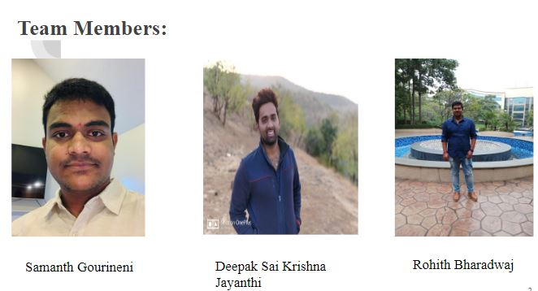

# BigQuery-Workshop

### Course: Big Data
### Semester : Spring-2020
### Section : 02
### Workshop Group: 03

### Team Members:
1. Rohith Bharadwaj - S534783@nwmissouri.edu
1. Samanth Gourineni- S534569@nwmissouri.edu
1. Deepak Sai Krishna Jayanthi - S534843@nwmissouri.edu 

Links:
1. [Github hub repo link](https://github.com/Samanthgourineni/BigQuery-Workshop)
1. [Google BigQuery](https://cloud.google.com/bigquery)

# Images:

Workshop Guide:
1. Open the console page of google big query platform , which looks like below.
2. [big query console link](https://console.cloud.google.com/bigquery?utm_source=bqui&utm_medium=link&utm_campaign=classic&project=stunning-ruler-270001)

References:
1. https://www.youtube.com/watch?v=qqbYrQGSibQ
1. https://www.slideshare.net/matthiasfeys/introduction-to-bigquery
1. https://cloud.google.com/bigquery/docs